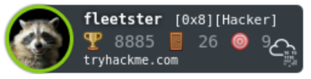

 

## Passions and Hobbies: 🏆

- Hacking
- Ultrarunning
- My 3 doggos
- Travel

I am a cybersecurity professional with a passion for lifelong learning and helping people.

I'm looking to collaborate wth others who also want to learn, grow and improve their security knowledge and skills.
 
 

## 2021 Goals: 🤓

Complete Python and Practical Ethical Hacking [Udemy Courses][4]  
Top 1000 [TryHackMe][5]  
Complete Overthewire Bandit [Wargames][6]  
Linux+ Certification

## Skills:

- Python
- Kali Linux
- Networking
- Javascript
- Bash
- CompTIA Network+
- CompTIA Security+  
   
  

---

 

## Links for More Info

 

📬 - [Email][2]  
💻 - [Website][3]  
💁 - [LinkedIn][1]

[1]: https://linkedin.com/in/fleetster22
[2]: mailto:anakanorfleet@gmail.com
[3]: https://fleetster22.github.io/portfolio/.
[4]: https://www.udemy.com/
[5]: https://tryhackme.com/p/fleetster
[6]: https://overthewire.org/wargames/

